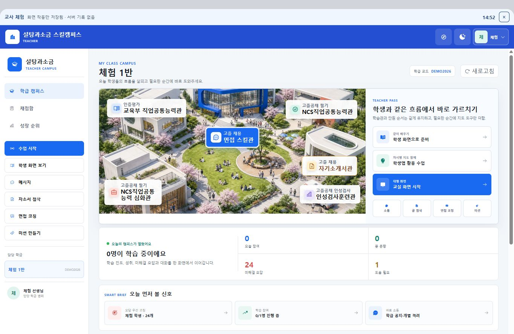
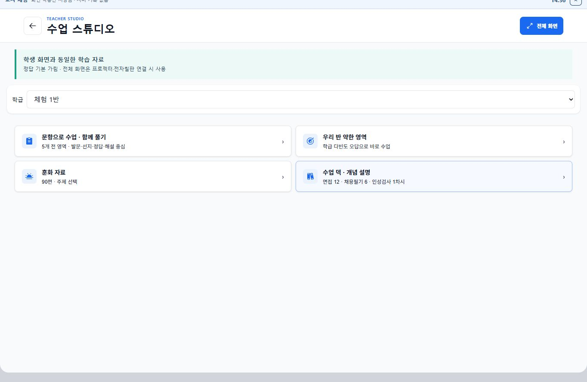
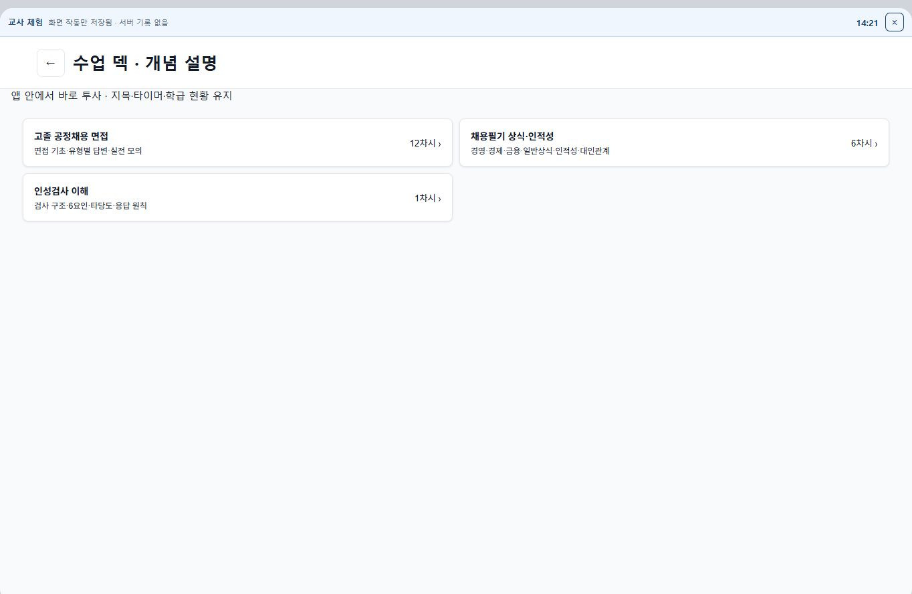
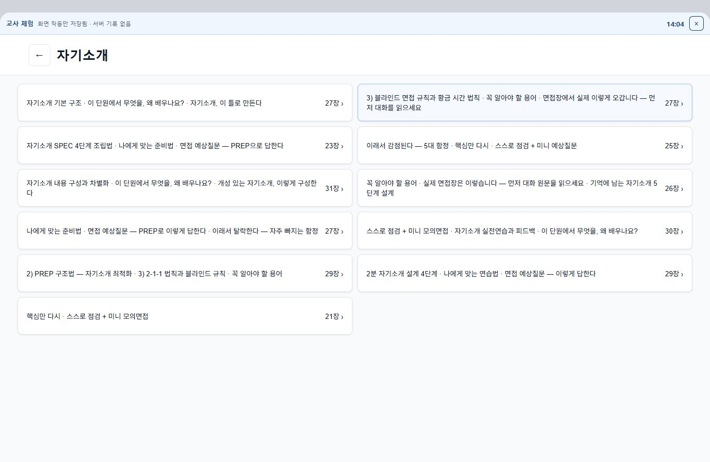
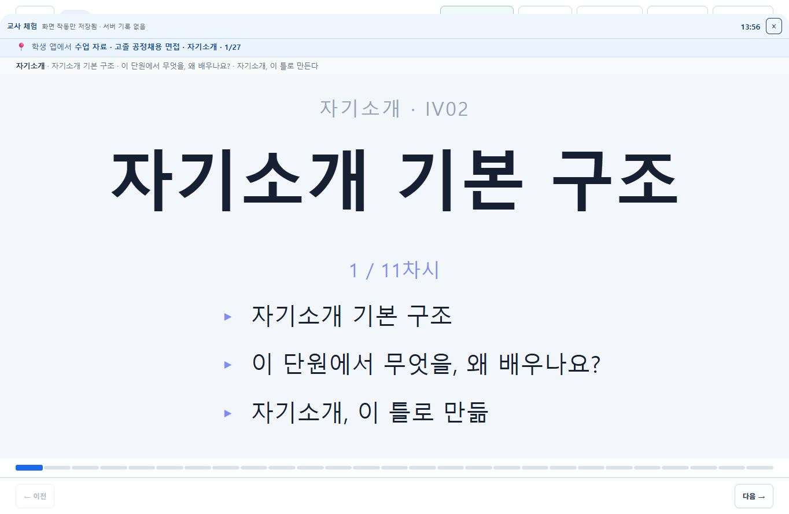

# 교사용 유료 제품 및 교실 수업 개편 전략

- 작성일: 2026-08-26
- 범위: 교사 로그인 이후 대시보드, 수업 준비, 수업 자료 선택, 교실 투사, 학교 도입 승인
- 결론: **교사용 환경을 웹 우선으로 통합하되, 공개 투사 화면과 비공개 교사 조종석은 분리한다.** 학생 앱은 현재의 모바일 중심 구조를 유지한다.

## 1. 최종 판단

현재 제품은 학생 자율학습과 교사 사후관리 도구로는 구매 이유가 생기기 시작했지만, 교실 수업에서는 아직 "콘텐츠를 크게 띄우는 재생기"에 가깝다. 수업 전, 수업 중, 수업 후가 하나의 기록과 행동 흐름으로 연결되지 않기 때문이다.

교사용 앱을 그대로 웹으로 옮기는 것만으로는 해결되지 않는다. 필요한 것은 다음 세 화면이 하나의 수업 세션을 공유하는 구조다.

1. **교사 조종석**: 학생 이름, 응답, 오답 원인, 교사 메모, 다음 행동을 보여주는 비공개 화면
2. **교실 무대**: 학생에게 보여도 되는 자료, 익명 응답, 타이머, 예시만 표시하는 공개 화면
3. **학생 참여 화면**: 현재 질문, 작성·선택·녹음·제출, 개인 피드백을 제공하는 학생 앱

이 구조는 Pear Deck도 Projector View, Student View, private Teacher Dashboard의 세 화면으로 분리해 운영한다. 중요한 차이는 화면 수가 아니라 **개인정보가 담긴 교사 화면을 투사하지 않으면서도 교사가 같은 수업을 통제할 수 있다는 점**이다.

## 2. 현재 흐름 감사

### 단계 1. 교사 대시보드 — 보통

- 강점: 학급, 첨삭, 면접, 미션, 수업 진입이 한 화면에 있고 학생 학습 데이터도 보인다.
- 문제: 가장 큰 영역이 캠퍼스 지도와 메뉴 반복에 쓰인다. 교사가 오늘 할 첫 행동인 "다음 수업 재개", "준비가 필요한 수업", "도움이 필요한 학생"은 아래로 밀린다.
- 판단: 콘텐츠 포털로는 보기 좋지만 매일 쓰는 업무 화면으로는 우선순위가 뒤집혀 있다.

### 단계 2. 수업 스튜디오 입구 — 미흡

- 강점: 문항, 약한 영역, 훈화, 개념 덱의 선택지는 명확하다.
- 문제: "45분 동안 무엇을 가르칠 것인가"가 아니라 자료 형식을 먼저 고르게 한다. 수업 목표, 예상 시간, 학생 준비도, 지난 수업과의 연결이 없다.
- 판단: 자료 창고의 입구이지 수업 준비 도구의 입구는 아니다.

### 단계 3. 콘텐츠 선택 — 미흡

- 강점: 큰 화면에서 클릭 영역이 넓다.
- 문제: 과목 수와 차시 수만 보이고, 학습 목표·예상 시간·필요 학생 활동·준비물·학급 적합도는 보이지 않는다.
- 판단: 교사는 선택 전에 수업의 결과를 예측할 수 없다.

### 단계 4. 차시 내부 선택 — 불량

- 한 선택지에 21~31장이 붙고 여러 소제목이 한 줄로 결합되어 있다.
- 교사는 "어디까지 하면 10분/25분/45분인가"를 알 수 없다.
- 현재 구조는 교재 목차를 슬라이드 묶음으로 변환한 것이며, 질문·활동·학생 산출물·피드백으로 구성된 수업안이 아니다.

### 단계 5. 교실 투사 — 미흡

- 강점: 큰 글씨, 진행 표시, 이전·다음, 정답 가림의 기본기는 있다.
- 문제: 첫 장부터 설명형 텍스트다. 학생이 무엇을 보고, 말하고, 작성하고, 제출할지가 없다.
- `현재 순서 지도`, `우리 반`, `답`은 상단 도구로 존재하지만 수업 단계 자체에 학생 반응 수집과 교사 의사결정이 내장되어 있지 않다.
- 체험 상단 상태 표시와 수업 도구가 겹치며, 화면 상단 조작부가 잘려 보이는 상태도 확인됐다.

## 3. 선택지 비교

| 선택지 | 교실 적합성 | 유지보수 | 모바일·오프라인 | 학교 확장 | 종합 |
|---|---:|---:|---:|---:|---:|
| 현재 앱과 교실 화면을 따로 개선 | 2 | 2 | 4 | 2 | 2.5 |
| 교사용 기능을 단순 웹 전환 | 3 | 5 | 2 | 4 | 3.5 |
| **웹 우선 교사 워크스페이스 + 투사 화면 분리 + 앱 셸 보완** | **5** | **4** | **4** | **5** | **4.6** |

### 단순 웹 전환의 장점

- PC, 태블릿, 스마트폰에서 같은 주소와 최신 버전을 사용한다.
- 앱스토어 심사 없이 수업 자료와 교사 기능을 빠르게 개선할 수 있다.
- 큰 화면, 키보드, 파일 업로드, 다중 창을 활용하기 쉽다.
- 교사용 기능 중 대시보드·첨삭·수업 설계는 모바일보다 웹이 본질적으로 적합하다.

### 단순 웹 전환의 위험

- 학교 무선망 장애 시 수업 전체가 멈출 수 있다.
- 브라우저 전체 화면은 플랫폼별 지원 차이가 있고 사용자 동작이 필요하다.
- 웹 화면 하나에 학생 정보와 투사 자료를 함께 두면 개인정보가 교실 화면에 노출된다.
- 모바일 앱 UI를 반응형으로 늘리기만 하면 넓고 빈 화면, 깊은 메뉴, 작은 조작부가 그대로 남는다.
- 알림, 백그라운드 동기화, 녹음·카메라, 파일 공유는 기기와 브라우저별 차이를 관리해야 한다.

따라서 앱을 없애는 것이 아니라 **교사용 제품의 원본을 웹으로 두고, 기존 앱은 같은 웹 기능을 감싸는 설치형 셸과 빠른 알림·촬영·녹음 도구로 축소**하는 편이 안전하다. PWA는 설치와 오프라인 캐시를 지원하지만 브라우저별 차이를 전제로 검증해야 한다.

## 4. 교사가 돈을 내는 핵심 서비스

### 수업 전: 5분 안에 준비 완료

- 다음 시간표와 직전 수업 위치를 첫 화면에 표시한다.
- `지난 시간 이어서`, `우리 반 오답으로 25분`, `면접 실습 45분`처럼 결과 중심으로 시작한다.
- 학급 데이터와 단원 목표를 조합해 10분·25분·45분 수업안을 자동 구성한다.
- 교사는 장을 고르는 대신 `도입 → 시범 → 개인 응답 → 비교 → 피드백 → 마무리` 단계를 편집한다.
- 모든 수업안은 미리 내려받아 음성·이미지·문항까지 오프라인 실행 가능하게 한다.

### 수업 중: 모두의 생각을 즉시 보고 수업을 바꿈

- 현재 활동을 학생 앱에 한 번에 연다.
- 선택형, 단답형, 근거 밑줄, 문장 수정, 자기소개 녹음, 모의면접 녹화를 수집한다.
- 교사 조종석에는 참여율, 응답 분포, 대표 오개념, 미제출 학생만 보인다.
- 교실 무대에는 이름을 제거한 응답만 선별하여 비교한다.
- `60%가 같은 실수 → 잘못된 사례 비교`, `정답률 80% 이상 → 다음 단계`처럼 분기 행동을 제안한다.
- 교사는 즉석 질문을 추가하고, 학생 화면을 잠그거나 개인·모둠·전체 활동으로 전환한다.

### 수업 후: 기록 정리가 아니라 다음 수업이 자동 준비됨

- 종료와 동시에 결석자·미완료자·재학습 대상에게 후속 활동을 배정한다.
- 학생별 산출물, 교사 구두·서면 피드백, 수정본을 한 묶음으로 남긴다.
- 다음 시간 시작 화면에 `지난 수업에서 가장 많이 막힌 2개 지점`을 제시한다.
- 자소서·면접은 한 번의 점수가 아니라 초안 → 피드백 → 수정 → 재시도의 성장 기록으로 보여준다.

이 구간이 유료 전환의 중심이다. EEF는 피드백의 학습 효과 근거가 강하지만, 교사 업무를 늘리는 방식은 피해야 한다고 강조한다. 따라서 "AI가 평가한다"보다 **교사가 더 빨리 정확한 피드백을 하고 학생이 바로 수정하게 한다**가 제품 약속이어야 한다.

## 5. 교실 콘텐츠 재설계 원칙

현재 21~31장 덱을 그대로 다듬는 작업은 중단하는 편이 낫다. 각 차시는 다음 규격으로 다시 제작한다.

1. 수업 목표는 한 문장, 학생 산출물은 한 개로 제한한다.
2. 기본 수업은 6~8개 단계로 구성하고 각 단계에 예상 시간을 둔다.
3. 모든 설명 뒤에는 학생 행동이 와야 한다: 선택, 말하기, 고치기, 비교, 녹음, 제출 중 하나.
4. 교사용 지원은 각 단계에 `할 말`, `물어볼 말`, `잘된 사례`, `잘못된 사례`, `실수 포인트`, `다음 분기`로 붙인다.
5. 자료를 장 수로 세지 않고 활동 수와 학생 산출물 수로 센다.
6. 면접·자소서는 설명 30%, 실제 사례 판단·수정·작성·말하기 70%를 목표로 한다.
7. 같은 콘텐츠를 자율학습, 교사 주도, 학생 주도 모드에서 재사용하되 진행 방식만 다르게 한다.

## 6. 학교장·교감이 승인하는 조건

관리자는 재미있는 수업 화면보다 위험, 비용, 업무, 효과를 본다. 다음을 제품 기능과 도입 자료로 제공해야 한다.

### 위험 관리

- 수집 데이터 목록, 처리 목적, 보관 기간, 파기 방법을 한 장으로 공개
- 광고 없음, 학생 데이터 판매·모델 학습 사용 없음 명시
- 교사·학생·학교관리자 권한 분리와 접근 기록
- 학급 종료·졸업 시 일괄 보관·삭제
- 개인정보 처리 위탁·재위탁 현황, 침해 대응 연락망, 장애 공지 페이지
- 학생 이름이 교실 투사 화면에 표시되지 않는 구조적 보호

2026년 교육부와 개인정보보호위원회가 에듀테크 개인정보 보호 실태점검을 공동 실시한 만큼, 개인정보는 부가 문서가 아니라 학교 승인 기능의 일부여야 한다.

### 운영 가능성

- 학교 계정 일괄 등록, 학급 명단 가져오기, 학년 진급·반 이동
- 크롬북·윈도·안드로이드 태블릿·스마트폰의 지원 범위 명시
- 인터넷 장애 시 수업 지속, 복구 후 자동 동기화
- 대체교사·공동담임·취업지원부가 수업을 이어받는 공동 운영
- 10분 시작 연수, 30분 실습 연수, 교사용 한 장 매뉴얼

### 효과 증명

- 도입 전후 `교사 준비 시간`, `학생 참여율`, `제출률`, `수정 완료율`, `피드백 소요 시간`, `취약 영역 개선`을 비교
- 사용 시간이나 클릭 수를 성과로 제시하지 않음
- 4주 파일럿 결과를 자동으로 학교 보고서 형태로 생성
- 교사·학생 만족도와 함께 수업 관찰 근거 및 실패 사례도 기록

UNESCO는 에듀테크 도입을 적절성, 형평성, 확장성, 지속가능성으로 판단하고 교사와 학생을 중심에 둘 것을 권고한다. OECD는 서로 연결되지 않은 도구가 수작업 재입력을 만들며, 데이터가 교사가 행동할 수 있는 정보로 바뀌어야 한다고 지적한다. 학교용 제품은 이 두 기준을 구매 제안서에 직접 답해야 한다.

## 7. 권장 상품 구조

### 교사 개인용

- 무제한 교실 세션
- 10·25·45분 수업 자동 구성
- 실시간 응답과 익명 공유
- 자소서·면접 피드백 및 재시도 기록
- 개인 자료 복제·편집

### 학교용

- 개인용 전체 기능
- 학교 계정·학급 일괄 관리
- 공동 수업·대체교사 인계
- 개인정보·접근·삭제 관리
- 학교 단위 콘텐츠 라이브러리와 승인 버전
- 관리자용 집계 보고서와 파일럿 효과 보고서
- 장애 대응 SLA와 온보딩 지원

관리자 화면은 학생 감시 도구가 되어서는 안 된다. 학교장은 개인 학생의 화면 체류 시간보다 학급별 참여 격차, 피드백 처리 지연, 수업 실행률, 취약 영역 개선 같은 집계 지표를 보게 해야 한다.

## 8. 우선순위 로드맵

### 1단계 — 수업 세션 골격

- 교사 조종석과 교실 무대 분리
- 학생 앱 현재 단계 동기화
- 공개·비공개 데이터 경계
- 오프라인 수업팩과 복구

### 2단계 — 한 과목의 완성형 수업

- 자기소개 또는 직무 한국어 듣기 한 과목만 선정
- 10·25·45분 수업안
- 실시간 응답, 익명 공유, 분기 지도, 종료 후 후속 활동까지 완성
- 기존 21~31장 덱을 이 기준으로 교체

### 3단계 — 교사 생산성

- 다음 수업 재개
- 우리 반 취약점 기반 자동 구성
- 교사 자료 편집·복제·공유
- 피드백 일괄 처리와 학생 재시도

### 4단계 — 학교 승인 패키지

- 개인정보·보안·저작권·접근성 문서
- 학급 일괄 등록과 연도 전환
- 관리자 집계 보고서
- 4주 파일럿과 도입 효과 보고서

기능 수가 아니라 한 번의 수업이 완전히 연결되는지를 단계별 출시 기준으로 삼는다. 1단계가 끝나기 전에 모든 과목을 변환하면 현재의 분절을 더 큰 규모로 복제하게 된다.

## 9. 출시 판단 지표

다음 기준을 충족하기 전에는 "교실 수업 완성"으로 부르지 않는다.

- 교사가 로그인 후 3번 이내의 주요 클릭으로 다음 수업을 시작
- 신규 교사가 설명 없이 5분 안에 25분 수업안을 준비
- 수업 중 90% 이상의 학생이 최소 한 번 응답
- 교사가 10초 이내에 미응답·대표 오개념·다음 행동을 파악
- 학생 개인정보가 투사 화면에 노출되는 경로 0건
- 네트워크 중단 후 음성·이미지·진행 제어가 계속 작동
- 수업 종료 1분 이내에 후속 활동과 요약 생성
- 4주 파일럿에서 준비·채점·피드백 시간이 감소하고 교사 재사용 의향이 확인

## 10. 근거와 한계

### 참고 근거

- [OECD Digital Education Outlook 2023](https://www.oecd.org/en/publications/oecd-digital-education-outlook-2023_c827b81a-en.html): 디지털 전환은 기존 방식을 화면으로 복제하는 것이 아니며, 상호운용성과 실행 가능한 데이터가 중요함.
- [OECD Digital Education Outlook 2026](https://www.oecd.org/en/publications/oecd-digital-education-outlook-2026_940e0dd8-en.html): AI가 교사 자율성과 보이지 않는 업무를 해치지 않도록 설계할 필요가 있음.
- [UNESCO 2023 GEM Report](https://gem-report-2023.unesco.org/): 적절성, 형평성, 확장성, 지속가능성과 교사 중심 도입 원칙.
- [EEF Using Digital Technology to Improve Learning](https://educationendowmentfoundation.org.uk/education-evidence/guidance-reports/digital): 기술보다 교수학습 문제와 구현 계획을 먼저 정의해야 함.
- [EEF Feedback](https://educationendowmentfoundation.org.uk/education-evidence/teaching-learning-toolkit/feedback): 피드백 효과와 교사 업무량의 균형.
- [Pear Deck Teacher Dashboard](https://help.peardeck.com/migration/en/the-teacher-dashboard): 교사 비공개 화면, 투사 화면, 학생 화면의 분리와 동기화 사례.
- [교육부 에듀테크 개인정보 보호 실태점검](https://www.moe.go.kr/boardCnts/viewRenew.do?boardID=294&boardSeq=106193&lev=0&m=020402&opType=N&page=1&s=moe&statusYN=W): 학교 도입에서 개인정보 보호가 현재의 직접적인 점검 대상임.
- [교육부 에듀테크 진흥방안](https://www.moe.go.kr/boardCnts/viewRenew.do?boardID=294&boardSeq=96398&lev=0&m=020402&opType=N&page=1&s=moe&statusYN=W): 공교육 지원, 맞춤교육, 도입 생태계 방향.
- [MDN PWA 설치](https://developer.mozilla.org/en-US/docs/Web/Progressive_web_apps/Guides/Making_PWAs_installable) 및 [오프라인 운영](https://developer.mozilla.org/en-US/docs/Web/Progressive_web_apps/Guides/Offline_and_background_operation): 웹 우선 설치형 앱과 오프라인 캐시의 가능성 및 플랫폼 차이.
- [MDN Fullscreen API](https://developer.mozilla.org/en-US/docs/Web/API/Fullscreen_API): 전체 화면 기능은 브라우저 호환성과 사용자 동작 제약을 전제로 해야 함.

### 한계

- 이번 평가는 2026-08-26 교사 체험 데이터와 현재 코드, 공개 근거를 사용했다.
- 실제 학교 교사, 취업부장, 교감, 학교장을 대상으로 한 사용자 인터뷰와 수업 관찰은 아직 수행하지 않았다.
- 스크린샷만으로 키보드 접근성, 스크린리더, 실제 교실 뒷자리 가독성 전체를 판정할 수 없다.
- 다음 단계에서는 최소 3개 학교, 교사 8~12명으로 현재 흐름과 새 수업 세션 프로토타입을 비교 검증해야 한다.
